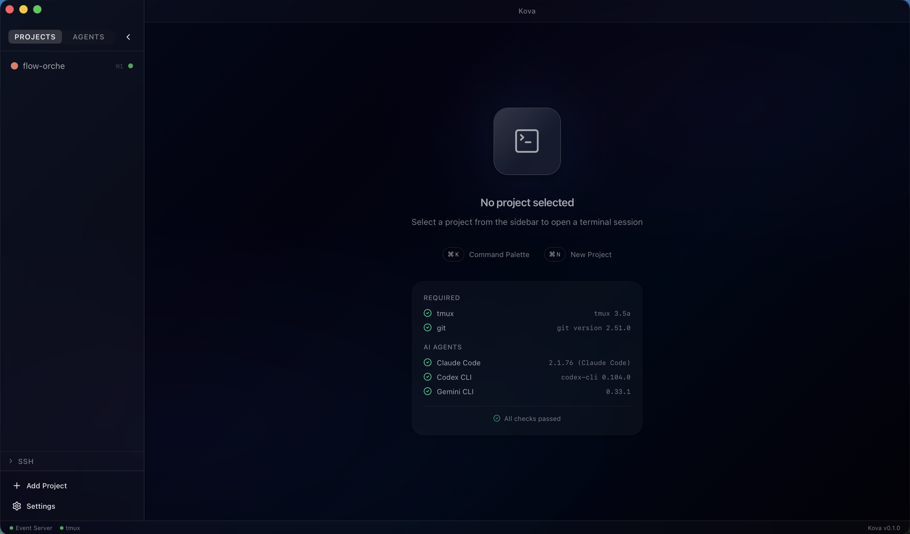
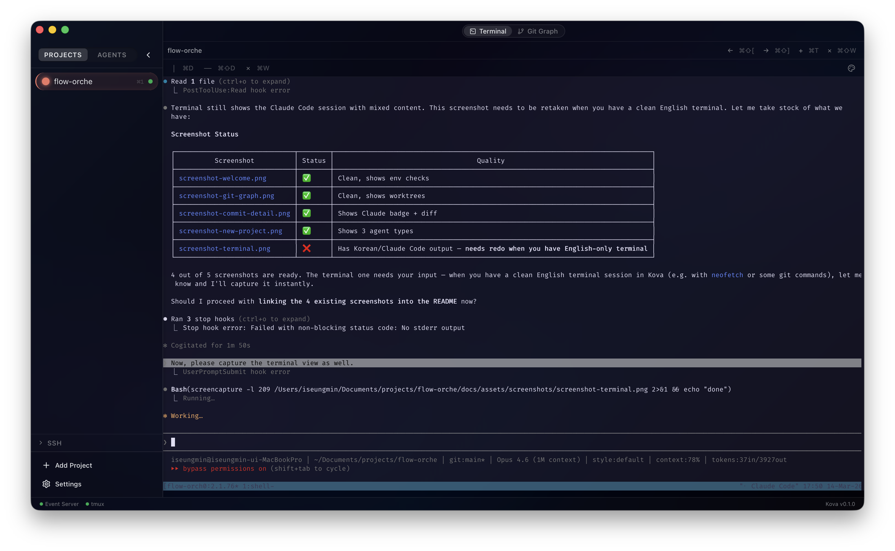
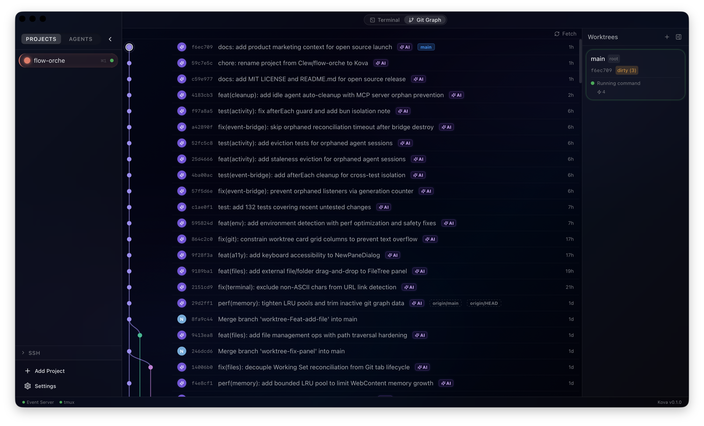
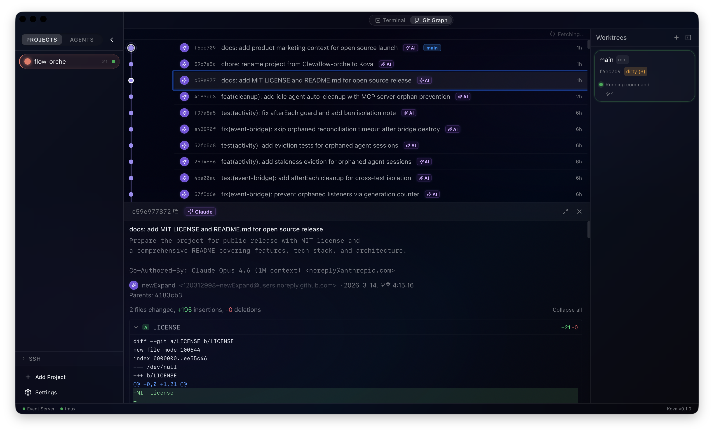
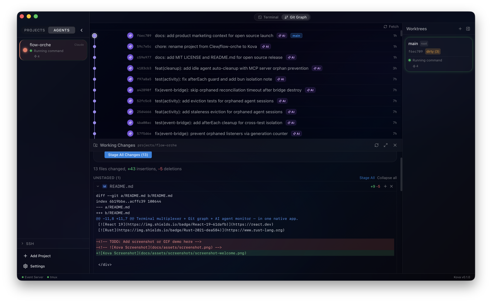
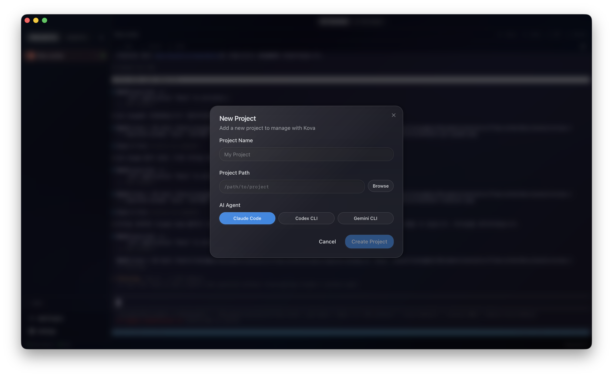
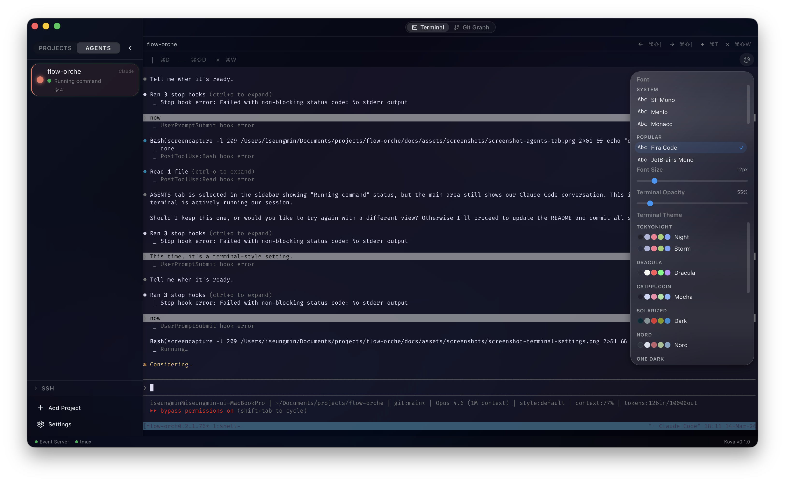
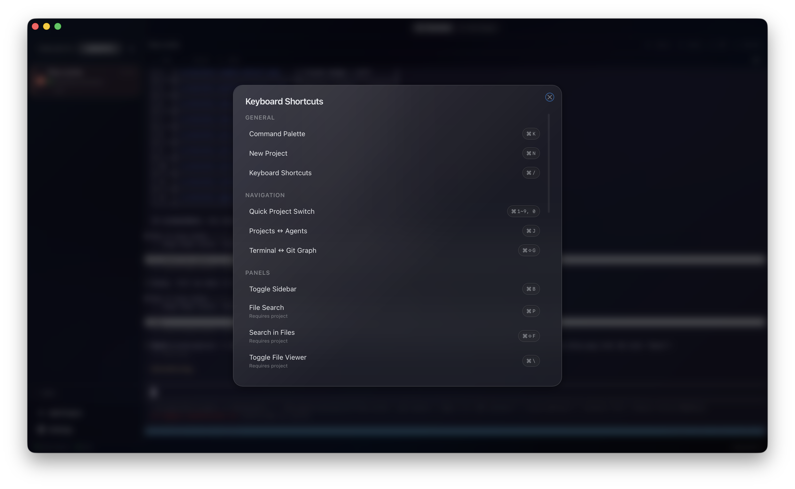
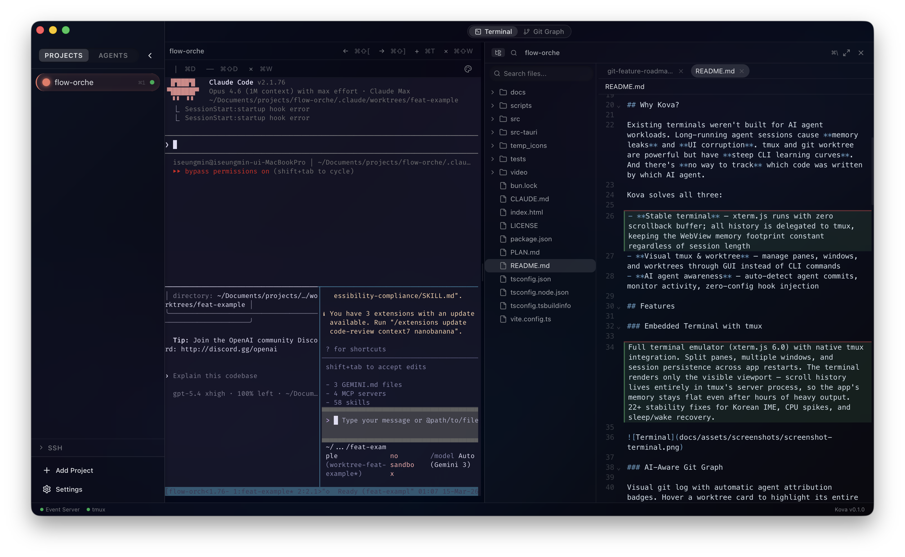

<div align="center">

# Kova

**A native terminal workspace with visual tmux/worktree management and AI agent awareness.**

Stable terminal + visual tmux & git worktree + AI agent monitoring — in one native macOS app.

[](LICENSE)
[](https://v2.tauri.app)
[](https://react.dev)
[](https://www.rust-lang.org)



[](https://github.com/newExpand/kova/releases/download/v0.1.0/kova-demo.mp4)

</div>

---

## Why Kova?

Using AI coding agents every day, I kept running into the same friction in the terminal — **memory getting heavy** as sessions grow, **managing tmux and worktrees through CLI** every time, and **no way to see at a glance** which commits came from which agent.

Kova started from that experience:

- **Stable terminal** — xterm.js runs with zero scrollback buffer; all history is delegated to tmux, keeping the WebView memory footprint constant regardless of session length
- **Visual tmux & worktree** — manage panes, windows, and worktrees through GUI instead of CLI commands
- **AI agent awareness** — auto-detect agent commits, monitor activity, zero-config hook injection

## Features

### Embedded Terminal with tmux

Full terminal emulator (xterm.js 6.0) with native tmux integration. Split panes, multiple windows, and session persistence across app restarts. The terminal renders only the visible viewport — scroll history lives entirely in tmux's server process, so the app's memory stays flat even after hours of heavy output. 22+ stability fixes for Korean IME, CPU spikes, and sleep/wake recovery.



### AI-Aware Git Graph

Visual git log with automatic agent attribution badges. Hover a worktree card to highlight its entire branch lane — and vice versa. Infinite scroll with virtual rendering for large repositories.



### Commit Detail with Agent Attribution

See exactly which commits were AI-generated. Full diff viewer with line-by-line highlighting and `Co-Authored-By` trailer detection. One click from graph to full diff.



### Working Changes

Stage, unstage, and commit directly from the git graph. Per-worktree dirty state tracking with file-level diff view.



### Multi-Agent Support

Supports **Claude Code**, **Codex CLI**, and **Gemini CLI**. Hook injection is automatic — create a project, and Kova installs the necessary hooks. Codex (which lacks hook support) is monitored via background process detection.



### Worktree Management

Create agent worktrees, assign tasks, track dirty state, and merge back to main — all from the GUI. Bidirectional cross-highlighting between worktree cards and git graph branches.

### Theme & Font Customization

12 dark terminal themes (Dracula, Nord, Catppuccin, Gruvbox, and more) and 9 font presets (JetBrains Mono, Cascadia Code, Iosevka, and more). Adjustable terminal opacity.



### Keyboard-Driven Workflow

Full keyboard shortcut system — ⌘/ shortcut help, ⌘K command palette, ⌘1-9 project switching, ⌘⇧G terminal/git toggle, ⌘P file search, and more.



### File Explorer & Editor



Browse project files with a virtualized tree. Built-in CodeMirror editor with syntax highlighting for 60+ languages. ⌘P fuzzy search, ⌘⇧F content search, and ⌘Click import navigation.

### SSH Remote

Connect to remote machines over SSH. Full terminal + git graph support on remote projects, with the same UX as local.

## Quick Start

### Prerequisites

- macOS 13+ Ventura (Apple Silicon or Intel)
- [tmux](https://github.com/tmux/tmux) installed (`brew install tmux`)
- [Git](https://git-scm.com/) installed
- At least one AI coding agent: [Claude Code](https://docs.anthropic.com/en/docs/claude-code), [Codex CLI](https://github.com/openai/codex), or [Gemini CLI](https://github.com/google-gemini/gemini-cli)

### Install via Homebrew (recommended)

```bash
brew tap newExpand/kova
brew install --cask kova
xattr -d com.apple.quarantine /Applications/Kova.app
```

### Download DMG

1. Download from the [latest release](https://github.com/newExpand/kova/releases/latest):
   - Apple Silicon: [Kova_0.1.0_aarch64.dmg](https://github.com/newExpand/kova/releases/latest/download/Kova_0.1.0_aarch64.dmg)
   - Intel: [Kova_0.1.0_x64.dmg](https://github.com/newExpand/kova/releases/latest/download/Kova_0.1.0_x64.dmg)
2. Open the DMG, drag **Kova** to Applications.
3. On first launch, macOS will block the app because it is not notarized. Remove the quarantine flag:
   ```bash
   xattr -d com.apple.quarantine /Applications/Kova.app
   ```
   Then open Kova normally.

### Build from Source

```bash
git clone https://github.com/newExpand/kova.git
cd kova
bun install
bun tauri build
```

The `.dmg` will be in `src-tauri/target/release/bundle/dmg/`.

> **Note**: Kova is macOS-only. Windows and Linux are not currently supported. See [Roadmap](#roadmap) for Linux plans.

## Tech Stack

| Layer | Technology |
|-------|-----------|
| **Framework** | [Tauri v2](https://v2.tauri.app) (Rust + WebView) |
| **Frontend** | React 19, TypeScript, Zustand, Tailwind CSS v4 |
| **Terminal** | xterm.js 6.0 + tauri-plugin-pty |
| **Git Graph** | d3-shape + Framer Motion |
| **Editor** | CodeMirror 6 |
| **Database** | SQLite (rusqlite, bundled) |
| **Backend** | Rust (serde, thiserror, tracing, tiny_http) |

## Architecture

```
┌─────────────────────────────────────────────┐
│                  React UI                    │
│  Terminal │ Git Graph │ Files │ SSH │ Notify │
├─────────────────────────────────────────────┤
│              Tauri IPC Bridge                │
├─────────────────────────────────────────────┤
│               Rust Services                  │
│  tmux │ git │ file │ ssh │ event_server │ pty│
├─────────────────────────────────────────────┤
│        SQLite  │  tmux CLI  │  Event Server  │
└─────────────────────────────────────────────┘

Hook Flow:
  AI Agent → curl POST 127.0.0.1:{PORT}/hook → Event Server
  → Tauri emit → Event Bridge → Notification Store → macOS Alert
```

## Project Structure

```
src/                    # React frontend
├── features/           # Feature modules (project, terminal, git, ssh, ...)
├── components/         # Shared UI components (Radix + CVA)
├── stores/             # Zustand global state
└── lib/                # Tauri IPC wrappers, event bridge

src-tauri/src/          # Rust backend
├── services/           # Business logic (~10K LOC)
├── commands/           # Tauri IPC handlers
├── models/             # Data types
└── db/                 # SQLite migrations
```

## Development

```bash
# Frontend + Backend dev server with HMR
bun tauri dev

# Rust lint
cargo clippy -- -D warnings

# Frontend type check + build
bun run build

# Run tests
bun run test
cargo test
```

## Roadmap

- [ ] Interactive rebase UI
- [ ] Stash management
- [ ] Cherry-pick workflow
- [ ] GitHub/GitLab integration (issues, PRs)
- [ ] Linux support
- [x] Homebrew tap distribution

## Contributing

Contributions are welcome! Please see [CONTRIBUTING.md](CONTRIBUTING.md) for guidelines.

## License

[MIT](LICENSE)

---

<div align="center">
Built with Tauri, React, and Rust.
</div>
