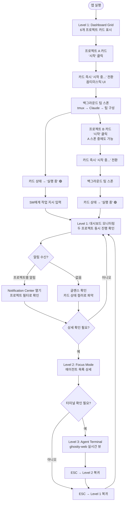
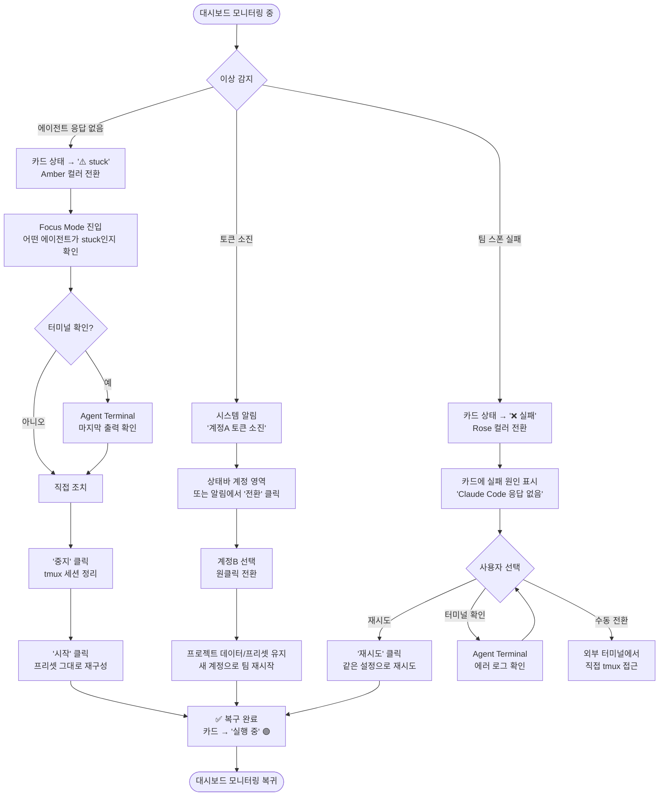
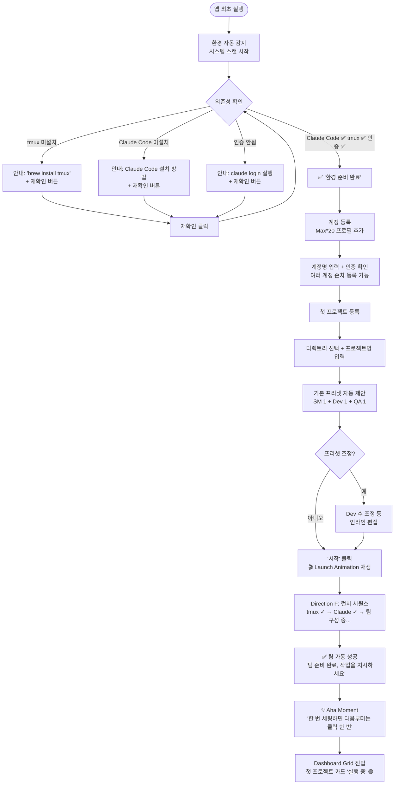

# UX Design Specification flow-orche

**Author:** flow-orche
**Date:** 2026-02-06

---

## Executive Summary

### Project Vision

flow-orche는 Claude Code Agent Teams를 시각적으로 관리하는 macOS 데스크톱 앱이다.
CLI + tmux 기반의 수동 반복 세팅을 "프로젝트 카드 원클릭"으로 대체하여,
개인 개발자의 멀티 에이전트 오케스트레이션 생산성을 극대화한다.

핵심 UX 가치: 복잡한 백그라운드 프로세스(tmux 세션 생성 → Claude Code 실행 → 팀 스폰)를
단일 클릭으로 추상화하되, 파워유저가 필요 시 각 단계를 제어할 수 있는 투명성을 유지한다.

### Target Users

**Primary: "승민" — Claude Code 파워유저 솔로 개발자**
- Claude Code Max*20 구독 계정 2개 보유, 동시 5~8개 프로젝트 관리
- BMAD Method로 계획→개발 파이프라인을 체계적으로 운영
- CLI/터미널에 매우 익숙하나, 반복 세팅 작업에 피로감을 느낌
- 기대: "한번 세팅하면 다음부터는 클릭 한 번"
- 기술 수준: 고급. 불필요한 가이드/위저드보다 효율적인 인터페이스를 선호

**UX 설계 시 고려사항:**
- CLI 경험에서 오는 높은 기대치 — 반응 속도, 키보드 친화, 정보 밀도
- "통제감" 중시 — 백그라운드에서 무슨 일이 일어나는지 항상 파악 가능해야 함
- 동시 관리 패턴 — 여러 프로젝트를 빈번히 전환하며 상태를 확인하는 워크플로우

### Key Design Challenges

1. **백그라운드 프로세스 시각화** — tmux 세션 생성, Claude Code 실행, 에이전트 팀 스폰 등
   다단계 프로세스의 진행 상태를 직관적으로 전달. 각 단계의 성공/진행/실패를 즉시 인지 가능하게.

2. **파워유저 친화 GUI** — CLI 사용자가 GUI의 제약으로 느끼지 않도록,
   키보드 단축키, 높은 정보 밀도, 빠른 반응 속도를 보장.
   과도한 모달/위저드/확인 단계를 지양.

3. **멀티 프로젝트 정보 아키텍처** — 5~8개 프로젝트가 동시에 다양한 상태에 있을 때
   정보 과부하 없이 핵심 상태를 즉시 식별 가능한 대시보드.

### Design Opportunities

1. **"원클릭 마법" 순간** — 시작 버튼 클릭 후 팀이 구성되는 과정의 시각적 피드백으로
   제품의 핵심 가치를 체감하게 하는 인상적인 마이크로인터랙션.

2. **개발자 도구 미학** — 터미널의 효율성 + macOS의 네이티브 디자인 + 전문적 정보 밀도를
   결합한 Developer Tool 고유의 시각 언어.

3. **프로젝트 컬러 코딩** — 각 프로젝트를 고유 색상/아이콘으로 구분하여
   알림, 대시보드, 상태바에서 즉시 식별 가능하게 하는 시각 시스템.

## Core User Experience

### Defining Experience

flow-orche의 핵심 경험은 **두 가지 모드**로 나뉜다:

**1. 액션 모드 — "프로젝트 카드 → 팀 시작"**
사용자의 가장 의도적인 행동. 프로젝트를 선택하고 팀을 구성하는 순간이 제품의 핵심 가치 전달 지점이다.
이 인터랙션은 빠르고, 안정적이고, 한 번의 클릭으로 완결되어야 한다.

**2. 모니터링 모드 — "대시보드에서 전체 상태 확인"**
팀이 잘 돌아갈수록 사용자의 주된 행동은 대시보드 확인으로 전환된다.
에이전트가 자율적으로 작업을 진행하는 동안, 사용자는 대시보드를 통해
여러 프로젝트의 진행 상태를 한눈에 파악한다.
이 모드에서의 핵심은 **수동적 정보 소비의 효율성** —
글랜스(glance) 한 번으로 "잘 돌아가고 있구나" 또는 "저 프로젝트에 문제가 있네"를
즉시 판단할 수 있어야 한다.

두 모드의 비중은 시간이 갈수록 모니터링 모드 쪽으로 이동한다.
AI 에이전트가 더 잘 작동할수록 사용자의 개입은 줄어들고 대시보드 확인이 주된 활동이 된다.

### Platform Strategy

- **플랫폼:** macOS 데스크톱 앱 (Tauri v2 + React 19)
- **입력 방식:** 마우스 + 키보드 (개발자 특성상 키보드 단축키 필수)
- **오프라인:** 프로젝트 관리, 프리셋 편집 등 로컬 데이터 CRUD는 오프라인 가능.
  Claude Code 의존 기능(팀 실행, 계정 인증)만 네트워크 필요
- **시스템 통합:** tmux CLI, Claude Code CLI, macOS Notification Center,
  파일시스템(프로젝트 디렉토리, hooks)

### Effortless Interactions

**완전 자동화 (사용자 인지 불필요):**
- tmux 세션 생성 및 프로젝트 디렉토리 이동
- 환경변수 설정 (CLAUDE_CODE_EXPERIMENTAL_AGENT_TEAMS=1)
- Claude Code 실행 및 프롬프트 준비 상태 감지
- 팀 프리셋 프롬프트 자동 전송
- 세션 정리 (중지 시)

**한 번의 클릭으로 완결:**
- 프로젝트 팀 시작/중지
- 계정 전환
- 실패 시 재시도

**별도 설정 없이 즉시 동작:**
- 환경 자동 감지 (첫 실행 시)
- 기본 프리셋 제공 (SM + Dev + QA)

### Critical Success Moments

**1. 첫 번째 원클릭 성공 (Onboarding)**
프로젝트 등록 후 [시작]을 누르고, 20초 안에 에이전트 팀이 가동되는 순간.
"아, 이거 한 번 세팅하면 다음부터는 클릭 한 번이구나."
→ 이 순간이 실패하면 제품 신뢰가 무너진다. 반드시 성공해야 하는 최우선 플로우.

**2. 자동 분류의 감탄 (Core Value)**
팀이 시작되고, AI 에이전트들이 사용자의 요구사항을 스스로 분류하여
각자 역할에 맞게 작업을 진행하는 것을 대시보드에서 확인하는 순간.
"내가 시킨 걸 알아서 나눠서 하고 있네."
→ 제품의 궁극적 가치를 체감하는 순간.

**3. 멀티 프로젝트 한눈에 파악 (Daily Value)**
대시보드를 열었을 때 5~6개 프로젝트의 상태가 즉시 보이고,
각 프로젝트에서 어떤 에이전트가 무엇을 하고 있는지 한눈에 파악되는 순간.

**4. 계정 전환 무결성 (Trust Moment)**
토큰 소진 시 계정을 전환해도 프로젝트 데이터와 프리셋이
완벽히 유지된 채로 즉시 재시작되는 순간.

### Experience Principles

1. **"MVP 기능은 전부 완벽하게"** — MVP에 포함된 핵심 기능(원클릭 실행, 상태 파악,
   에러 감지, 계정 전환)은 모두 높은 안정성과 완성도로 동작해야 한다.
   하나라도 불안정하면 터미널로 회귀한다.

2. **"글랜스로 파악, 원클릭으로 액션"** — 대시보드는 보는 즉시 상태가 파악되어야 하고,
   모든 주요 액션은 단일 클릭으로 완결되어야 한다.
   2단계 이상의 확인/설정이 필요하면 설계를 재검토한다.

3. **"보이지 않는 자동화, 보이는 결과"** — tmux/Claude Code 실행 같은 기술적 과정은
   사용자에게 노출하지 않되, 결과(팀 가동 상태, 에이전트 활동)는 명확히 보여준다.
   단, 문제 발생 시에는 기술적 세부사항도 접근 가능해야 한다.

4. **"AI가 알아서, 사용자는 지켜보며"** — 제품의 궁극적 가치는 사용자의 개입을
   최소화하는 것이다. 에이전트가 자율적으로 작업을 분류하고 진행하는 동안,
   사용자는 대시보드에서 진행 상황을 모니터링하는 것이 이상적인 사용 패턴이다.

## Desired Emotional Response

### Primary Emotional Goals

**1차 감정: "감탄과 놀라움"**
"이게 알아서 이렇게까지 해주네?" — 원클릭으로 팀이 구성되고,
AI 에이전트들이 요구사항을 자동 분류하여 작업을 진행하는 모습에서 느끼는 놀라움.
기술적 복잡성이 매끄럽게 추상화되어 마법처럼 동작하는 경험.

**2차 감정: "프로페셔널한 자부심"**
"나는 최첨단 도구를 쓰는 파워유저다" — 세련되고 전문적인 인터페이스를 통해
멀티 에이전트 오케스트레이션을 관리하는 나 자신에 대한 자부심.
다른 개발자는 아직 터미널에서 수동으로 하고 있지만, 나는 이미 다음 단계에 있다는 확신.

**장기 감정: "내 워크스테이션이라는 소유감"**
"이건 내 도구다" — 매일 사용하면서 프로젝트 프리셋이 쌓이고,
나만의 팀 구성 패턴이 축적되며, 점점 더 나에게 맞춰지는 느낌.
범용 도구가 아닌, 나의 워크플로우에 특화된 개인 워크스테이션이라는 소유감.

### Emotional Journey Mapping

| 단계 | 감정 | 설계 방향 |
|------|------|----------|
| **첫 발견/설치** | 기대감, 호기심 | 깔끔한 첫 화면, 빠른 환경 감지로 "이건 제대로 만들어졌구나" 인상 |
| **첫 팀 실행** | 감탄, 놀라움 | 원클릭 → 팀 가동의 매끄러운 전환, 인상적인 시각 피드백 |
| **일상 사용** | 소유감, 효율 | 나만의 프리셋과 프로젝트가 쌓이는 느낌, 글랜스 대시보드 |
| **에러 발생** | 차분한 통제감 | 당황하지 않도록 명확한 상태 표시, 즉각적인 복구 경로 제시 |
| **계정 전환** | 안심, 신뢰 | 데이터 무결성 확인, 매끄러운 전환으로 "안전하다"는 확신 |
| **재방문** | 친숙함, 편안함 | 이전 상태 유지, 중단한 곳에서 바로 이어가는 경험 |

### Micro-Emotions

**강화해야 할 감정:**
- **자신감(Confidence)** — 모든 버튼과 상태가 명확하여 "이걸 누르면 이런 일이 일어난다"는 확신
- **신뢰(Trust)** — 백그라운드 프로세스가 정확히 동작하고 있다는 믿음
- **성취감(Accomplishment)** — 여러 프로젝트가 동시에 진행되는 대시보드를 보며 느끼는 생산성
- **독점감(Exclusivity)** — 아직 소수만 사용하는 최첨단 워크플로우를 운영한다는 우월감

**방지해야 할 감정:**
- **불안(Anxiety)** — "지금 뭐가 돌아가고 있는 거지?" → 상태 불투명
- **좌절(Frustration)** — "왜 안 되지?" → 에러 원인 불명
- **불신(Skepticism)** — "진짜 제대로 하고 있는 건가?" → 에이전트 활동 불가시
- **번거로움(Tedium)** — "또 이걸 해야 해?" → 반복 수동 작업

### Design Implications

| 감정 목표 | UX 설계 접근 |
|-----------|-------------|
| **감탄/놀라움** | 팀 시작 시 단계별 진행 애니메이션, 에이전트 활성화 시각 효과. "마법이 일어나는" 느낌의 마이크로인터랙션 |
| **자부심** | 전문적이고 세련된 다크 테마 UI, 정보 밀도 높은 대시보드. 개발자 도구의 프리미엄 미학 |
| **소유감** | 프로젝트별 커스텀 컬러/아이콘, 프리셋 누적, 사용 패턴 기반 개인화. "내 것"이라는 느낌의 커스터마이즈 |
| **통제감 (에러 시)** | 에러 상태의 명확한 시각 구분, 원인과 복구 방법을 한 화면에 표시. 패닉이 아닌 "상황 보고" 톤 |
| **신뢰** | 실시간 상태 업데이트, 각 단계의 성공/실패 명시적 표시. 백그라운드에서 무엇이 일어나는지 항상 파악 가능 |

### Emotional Design Principles

1. **"놀라움은 첫 경험에서, 신뢰는 반복에서"** — 첫 사용에서 감탄을 주되,
   매일 사용에서는 안정적이고 예측 가능한 경험으로 신뢰를 쌓는다.
   플래시한 효과보다 일관된 동작이 장기 감정에 더 중요하다.

2. **"에러는 당황이 아닌 정보"** — 문제 발생 시 감정적 톤은 "경고"가 아닌 "보고"다.
   빨간 경고등이 아닌, 상황 설명 + 복구 옵션의 차분한 안내.
   사용자가 "아, 이런 상황이구나. 이렇게 하면 되겠다"고 즉시 판단할 수 있게.

3. **"도구는 투명하게, 결과는 인상적으로"** — 기술적 복잡성(tmux, CLI)은 숨기되,
   그 결과(팀 구성, 에이전트 활동, 프로젝트 진행)는 시각적으로 인상 깊게 표현한다.
   도구 자체가 아닌 사용자의 성과가 주인공이 되게.

4. **"쌓일수록 더 나의 것"** — 사용할수록 프리셋, 프로젝트 히스토리, 패턴이 축적되어
   앱이 점점 더 개인화된다. 초기화하고 싶지 않은, 대체 불가한 "내 워크스테이션".

## UX Pattern Analysis & Inspiration

### Inspiring Products Analysis

**1. Linear — 개발자 친화 프로젝트 관리의 정석**

Linear는 개발자가 "이건 개발자가 만든 도구다"라고 즉시 느끼는 UX를 제공한다.

- **키보드 퍼스트**: 모든 액션에 단축키 제공, Cmd+K 커맨드 팔레트로 모든 기능 접근
- **속도에 대한 집착**: 로딩 스피너가 거의 없음. 옵티미스틱 UI로 즉시 반응
- **정보 밀도**: 한 화면에 많은 정보를 담되 시각적 위계로 정리. 개발자는 정보가 많은 걸 좋아함
- **다크 테마 기본**: 개발자 도구의 프리미엄 미학
- **상태 전환의 명확성**: 이슈 상태(Backlog → In Progress → Done)가 색상과 아이콘으로 즉시 식별

→ **flow-orche 적용점**: 키보드 단축키 체계, Cmd+K 팔레트, 옵티미스틱 UI 반응 속도,
  프로젝트 상태의 색상/아이콘 시스템

**2. Docker Desktop — CLI 도구의 GUI 래퍼 패턴**

Docker Desktop은 Docker CLI를 GUI로 감싸면서도 파워유저를 잃지 않은 사례다.

- **컨테이너 카드 목록**: 실행 중/중지/에러 상태를 컬러로 즉시 구분
- **원클릭 시작/중지**: 복잡한 docker run 명령을 버튼 하나로 추상화
- **로그 접근성**: 문제 시 컨테이너 로그를 즉시 확인 가능 — "보이지 않는 자동화, 필요 시 투명"
- **리소스 모니터링**: CPU/메모리 사용량을 대시보드에 표시
- **멀티 컨테이너 동시 관리**: 여러 컨테이너의 상태를 한 목록에서 관리

→ **flow-orche 적용점**: 프로젝트 카드의 상태 컬러 시스템, 원클릭 시작/중지 패턴,
  에러 시 로그 접근 방식, 멀티 프로젝트 목록 레이아웃

**3. Vercel Dashboard — 배포 프로세스 시각화의 모범**

Vercel은 보이지 않는 빌드/배포 프로세스를 사용자가 직관적으로 파악할 수 있게 시각화한다.

- **프로젝트 카드 그리드**: 각 프로젝트의 최신 상태가 카드에 요약 표시
- **배포 단계 시각화**: Building → Deploying → Ready 단계별 진행 표시
- **실시간 로그 스트리밍**: 빌드 과정을 실시간으로 확인 가능
- **성공/실패의 명확한 시각 구분**: 초록(성공), 빨강(실패), 노랑(진행 중)의 직관적 컬러
- **깔끔한 타이포그래피**: 정보가 많지만 읽기 쉬운 시각적 위계

→ **flow-orche 적용점**: 팀 스폰 단계별 진행 시각화 (tmux → Claude → 팀 구성),
  프로젝트 카드 그리드 레이아웃, 상태별 컬러 시스템, 에러 시 로그 접근

### Transferable UX Patterns

**내비게이션 패턴:**
- **Cmd+K 커맨드 팔레트** (Linear) → 프로젝트 검색, 빠른 액션 실행, 설정 접근
- **사이드바 + 메인 콘텐츠** (Linear/Docker) → 프로젝트 목록(사이드바) + 선택된 프로젝트 상세(메인)

**인터랙션 패턴:**
- **원클릭 시작/중지** (Docker) → 프로젝트 팀 실행/중지의 핵심 인터랙션
- **옵티미스틱 UI** (Linear) → 클릭 즉시 UI 반영, 백그라운드에서 실제 작업 진행
- **단계별 진행 표시** (Vercel) → 팀 스폰 과정의 시각적 피드백

**시각 패턴:**
- **상태 컬러 시스템** (Vercel/Docker) → 초록(실행 중), 회색(비활성), 빨강(에러), 노랑(진행 중)
- **다크 테마 + 높은 정보 밀도** (Linear) → 개발자 도구의 프리미엄 미학
- **카드 기반 프로젝트 목록** (Vercel) → 각 프로젝트의 핵심 상태를 카드에 요약

**에러 핸들링 패턴:**
- **인라인 로그 접근** (Docker/Vercel) → 에러 발생 시 해당 프로젝트 카드에서 바로 로그 확인
- **재시도 버튼** (Vercel) → 실패 시 같은 자리에서 즉시 재시도

### Anti-Patterns to Avoid

1. **과도한 모달/위저드** — 개발자는 단계별 위저드를 싫어함.
   프로젝트 등록이 3단계 위저드가 되면 안 됨. 한 화면에서 완결.

2. **로딩 스피너 남용** — 빈 화면에 스피너만 돌리면 "뭐가 되고 있는 거지?" 불안감 유발.
   무엇을 기다리고 있는지 단계별로 보여줘야 함.

3. **확인 대화상자 과다** — "정말 시작하시겠습니까?" 같은 불필요한 확인.
   시작/중지 같은 핵심 액션은 즉시 실행, 되돌리기(Undo)로 안전망 제공.

4. **상태 불투명** — 에이전트가 뭘 하고 있는지 안 보이면 불신 발생.
   "처리 중..."만 표시하면 안 됨. 구체적인 단계/상태를 보여줘야 함.

5. **CLI 복잡성 그대로 노출** — tmux 세션명, 환경변수 등 기술적 세부사항을
   기본 UI에 노출하면 GUI의 의미가 사라짐. 필요 시에만 접근 가능하게.

### Design Inspiration Strategy

**채택 (Adopt):**
- Cmd+K 커맨드 팔레트 (Linear) — 파워유저의 빠른 네비게이션 핵심
- 상태 컬러 시스템 (Vercel/Docker) — 글랜스로 파악하는 핵심 수단
- 원클릭 시작/중지 (Docker) — 제품의 핵심 가치 인터랙션
- 다크 테마 기본 (Linear) — 개발자 도구 미학의 기반

**적응 (Adapt):**
- 배포 단계 시각화 (Vercel) → 팀 스폰 단계 시각화로 변환
  (tmux 생성 → Claude 실행 → 프롬프트 감지 → 팀 구성)
- 컨테이너 카드 (Docker) → 프로젝트 카드로 변환
  (프로젝트명, 팀 구성, 상태, 마지막 활동)
- 프로젝트 그리드 (Vercel) → 5~8개 프로젝트에 최적화된 밀도

**회피 (Avoid):**
- 과도한 온보딩 투어 — 환경 감지 + 계정 등록 + 첫 프로젝트, 최소 단계로
- 설정 페이지 깊은 중첩 — 프리셋 편집은 프로젝트 카드에서 인라인으로
- 알림 과다 — 프로젝트별 중요 이벤트만, 빈도 조절 가능하게

## Design System Foundation

### Design System Choice

**Tailwind CSS v4 + shadcn/ui** — Themeable System

React 19 기반의 유틸리티 퍼스트 CSS + 소유형 컴포넌트 라이브러리 조합.
컴포넌트 코드를 프로젝트에 직접 소유하므로 완전한 커스터마이즈가 가능하면서도,
검증된 접근성과 인터랙션 패턴을 기반으로 빠르게 개발할 수 있다.

### Rationale for Selection

1. **완전한 커스터마이즈** — shadcn/ui는 컴포넌트를 npm 패키지로 설치하는 게 아니라
   프로젝트에 복사하여 직접 소유. Linear/Vercel 수준의 세련된 다크 테마를
   제약 없이 구현 가능.

2. **1인 개발 + AI 보조에 최적** — Tailwind의 유틸리티 클래스는 AI 코드 생성과 궁합이 좋음.
   shadcn의 검증된 컴포넌트 구조 위에서 빠르게 커스터마이즈하는 패턴.

3. **다크 테마 네이티브** — CSS 변수 기반 테마 시스템이 내장되어 있어
   다크 테마 기본 + 향후 라이트 모드 확장이 용이.

4. **높은 정보 밀도 지원** — Tailwind의 세밀한 spacing 제어와 shadcn의 컴팩트한
   컴포넌트로 개발자 도구에 적합한 높은 정보 밀도 구현 가능.

5. **Tauri + React 완벽 호환** — 웹 표준 기술 기반, 별도 네이티브 바인딩 불필요.
   Tauri v2의 웹뷰에서 최적 렌더링.

6. **커뮤니티/생태계** — shadcn/ui는 2024~2026년 React 생태계에서 가장 활발한
   컴포넌트 시스템. 풍부한 레퍼런스와 확장 컴포넌트 생태계.

### Implementation Approach

**기술 스택 구성:**
- Tailwind CSS v4 (CSS 변수 기반 @theme 패턴)
- shadcn/ui (Radix UI 기반 컴포넌트)
- React 19 + TypeScript
- Lucide Icons (shadcn 기본 아이콘 세트)

**도입 순서:**
1. Tauri + React 프로젝트에 Tailwind CSS v4 설정
2. shadcn/ui 초기화 및 다크 테마 기본 설정
3. 핵심 컴포넌트 설치: Button, Card, Dialog, DropdownMenu, Badge, Tooltip
4. 프로젝트 고유 디자인 토큰 정의 (컬러, 스페이싱, 타이포)
5. 프로젝트 카드, 대시보드 등 커스텀 컴포넌트 구축

### Customization Strategy

**디자인 토큰 커스터마이즈:**

- **Primary Color**: 프로젝트 액션(시작, 생성 등)에 사용하는 브랜드 컬러
- **Status Colors**: 실행 중(초록), 비활성(회색), 에러(빨강), 진행 중(노랑/앰버)
- **Project Colors**: 프로젝트별 구분을 위한 8색 팔레트
- **Surface Colors**: 다크 테마의 레이어별 배경색 (카드, 사이드바, 메인 등)
- **Typography**: 시스템 폰트 기반, 모노스페이스 혼용 (코드/경로 표시용)
- **Spacing**: 컴팩트한 정보 밀도를 위해 기본 간격 축소

**커스텀 컴포넌트 (shadcn 확장):**

- **ProjectCard** — 프로젝트 상태, 팀 구성, 액션 버튼을 통합한 핵심 카드
- **StatusBadge** — 실행 중/비활성/에러/진행 중 상태를 컬러+텍스트로 표시
- **LaunchProgress** — 팀 스폰 단계별 진행 표시 (tmux → Claude → 팀)
- **CommandPalette** — Cmd+K 커맨드 팔레트 (cmdk 라이브러리 기반)
- **NotificationPanel** — 프로젝트별 알림 목록
- **TeamPresetEditor** — 팀 구성 프리셋 편집 인터페이스

## Defining Experience

### Defining Interaction

> **"프로젝트 카드 클릭 한 번으로 AI 에이전트 팀이 세팅되고, 내가 지시하면 알아서 나눠서 일한다"**

flow-orche의 원클릭은 "팀 세팅의 자동화"다.
기존에 수동으로 반복하던 tmux 생성 → 디렉토리 이동 → Claude 실행 → 팀 구성 타이핑을
버튼 한 번으로 완결한다. 팀이 준비되면 사용자가 오늘의 작업을 지시하고,
SM 에이전트가 알아서 분류하여 Dev/QA에게 할당한다.

**원클릭의 범위 (자동화):**
프로젝트 카드 [시작] → tmux 세션 생성 → Claude Code 실행 → 팀 스폰 완료

**사용자 개입 (매번 다름):**
팀 준비 완료 후 → SM에게 오늘의 작업 지시 입력

**그 이후 (AI 자율):**
SM이 요구사항 분류 → Dev에게 스토리 할당 → 작업 진행 → QA 리뷰

### User Mental Model

**현재 사용자의 멘탈 모델:**
"터미널에서 tmux로 세션 만들고, Claude 실행해서 팀 구성을 타이핑으로 지시한다"
→ 매번 같은 세팅을 반복하는 것이 번거롭고, 프로젝트가 많을수록 고통이 커짐

**flow-orche가 제시하는 새 멘탈 모델:**
"프로젝트 카드를 누르면 팀이 준비된다. 나는 할 일만 말하면 된다"
→ 세팅은 앱이, 지시는 내가, 실행은 AI가

**익숙한 비유:**
- Docker Desktop에서 컨테이너 시작하듯 프로젝트 팀을 시작
- Vercel에서 배포 트리거하듯 에이전트 파이프라인을 트리거
- IDE의 Run 버튼을 누르듯 팀을 가동

### Success Criteria

**"이건 된다" — 핵심 성공 기준:**

1. **시작 클릭 → 팀 준비 완료: 20초 이내** — 사용자가 "느리다"고 느끼기 전에 완료
2. **추가 수동 개입 제로** — 클릭 후 팀이 준비될 때까지 아무것도 안 해도 됨
3. **실패 시 명확한 안내** — 어느 단계에서 왜 실패했는지 즉시 파악 + 재시도 원클릭
4. **프리셋 재사용** — 한번 저장한 팀 구성은 다음에도 클릭 한 번으로 동일하게 적용
5. **동시 실행** — 프로젝트 A를 시작하고, 팀이 가동되는 동안 프로젝트 B도 시작 가능

**"이건 좋다" — 차별화 성공 기준:**

6. **진행 단계 시각화** — tmux 생성 ✓ → Claude 실행 ✓ → 팀 스폰 중... 단계가 보임
7. **팀 준비 알림** — 팀이 준비되면 "팀 준비 완료, 작업을 지시하세요" 알림
8. **프로젝트별 즉시 구분** — 대시보드에서 어떤 프로젝트가 어떤 상태인지 글랜스로 파악

### Novel UX Patterns

**익숙한 패턴의 새로운 조합:**

flow-orche는 완전히 새로운 인터랙션을 발명하지 않는다.
대신 개발자가 이미 익숙한 패턴들을 "AI 에이전트 팀 오케스트레이션"이라는
새로운 맥락에 조합한다.

| 패턴 | 출처 | flow-orche 적용 |
|------|------|----------------|
| 프로젝트 카드 그리드 | Vercel, GitHub | 프로젝트 목록 + 상태 요약 |
| 원클릭 시작/중지 | Docker Desktop | 팀 실행/중지 |
| 단계별 진행 표시 | Vercel 빌드 로그 | 팀 스폰 진행 시각화 |
| 상태 컬러 시스템 | CI/CD 도구 전반 | 프로젝트/에이전트 상태 |
| Cmd+K 팔레트 | Linear, Raycast | 빠른 프로젝트 전환/액션 |

**유일하게 새로운 패턴:**
"팀 프리셋" 개념 — 에이전트 팀 구성(SM + Dev + QA)을 저장하고 재사용하는 UI.
이는 기존에 없는 패턴이므로 직관적인 편집 UI가 필요하다.
Docker Compose 파일 편집의 GUI 버전이라고 생각할 수 있다.

### Experience Mechanics

**1. 시작 (Initiation)**

- 사용자가 대시보드에서 프로젝트 카드의 [시작] 버튼 클릭
- 또는 Cmd+K → 프로젝트명 입력 → "시작" 선택
- 카드 상태가 즉시 "시작 중..."으로 전환 (옵티미스틱 UI)

**2. 진행 (Process)**

- 카드 내에 단계별 진행 표시:
  - ✓ tmux 세션 생성
  - ✓ Claude Code 실행
  - ◐ 프롬프트 준비 감지 중...
  - ○ 팀 프리셋 전송
  - ○ 팀 스폰 완료
- 각 단계 성공 시 체크 표시 전환, 실패 시 해당 단계에서 에러 표시

**3. 완료 (Completion)**

- 모든 단계 완료 시 카드 상태가 "실행 중"(초록)으로 전환
- macOS 알림: "{프로젝트명} 팀 준비 완료"
- 사용자가 SM에게 작업 지시를 입력할 수 있는 상태

**4. 작업 지시 (User Input)**

- 팀 준비 완료 후, 사용자는 외부 터미널에서 tmux 세션에 attach하여
  SM에게 작업 지시 입력 (MVP)
- 또는 앱 내 간단 입력 필드에서 지시 전송 (tmux send-keys 활용)

**5. 모니터링 (Ongoing)**

- 대시보드에서 프로젝트 상태 실시간 확인
- 프로젝트별 알림 수신 (작업 완료, 에러, 사용자 입력 대기)
- 필요 시 [중지] → tmux 세션 정리 → 재시작 가능

## Visual Design Foundation

### Color System

**Primary Accent: Indigo-Blue (#6366F1 계열)**

AI 오케스트레이션 도구의 정체성을 표현하는 인디고 블루.
Linear의 차분한 전문성과 AI의 미래지향적 느낌을 동시에 전달한다.
순수 블루보다 약간 바이올렛이 섞여 "단순 개발 도구"가 아닌
"AI 레버리지 플랫폼"이라는 차별점을 시각적으로 암시.

**시맨틱 컬러 맵핑:**

| 용도 | 컬러 | Hex (다크 테마) | 사용처 |
|------|------|----------------|--------|
| **Primary** | Indigo | #6366F1 | 시작 버튼, 주요 액션, 브랜드 포인트 |
| **Primary Hover** | Indigo Light | #818CF8 | Primary 호버 상태 |
| **Success/Running** | Emerald | #10B981 | 실행 중 상태, 성공 표시 |
| **Warning/Progress** | Amber | #F59E0B | 진행 중, 대기 중 상태 |
| **Error** | Rose | #F43F5E | 에러, 실패, stuck 상태 |
| **Neutral/Inactive** | Zinc | #71717A | 비활성 프로젝트, 보조 텍스트 |

**프로젝트 구분 팔레트 (8색):**

각 프로젝트에 자동 또는 수동으로 부여되는 식별 컬러.
대시보드, 알림, 상태바에서 프로젝트를 즉시 구분하는 데 사용.

| # | 이름 | Hex | 용도 예시 |
|---|------|-----|----------|
| 1 | Sky | #38BDF8 | 프로젝트 A |
| 2 | Violet | #8B5CF6 | 프로젝트 B |
| 3 | Emerald | #34D399 | 프로젝트 C |
| 4 | Amber | #FBBF24 | 프로젝트 D |
| 5 | Rose | #FB7185 | 프로젝트 E |
| 6 | Cyan | #22D3EE | 프로젝트 F |
| 7 | Orange | #FB923C | 프로젝트 G |
| 8 | Lime | #A3E635 | 프로젝트 H |

**다크 테마 서피스 레이어:**

| 레이어 | 용도 | Hex |
|--------|------|-----|
| **Base** | 앱 배경 | #09090B (Zinc-950) |
| **Surface 1** | 사이드바, 패널 배경 | #18181B (Zinc-900) |
| **Surface 2** | 카드, 모달 배경 | #27272A (Zinc-800) |
| **Surface 3** | 호버 상태, 선택 상태 | #3F3F46 (Zinc-700) |
| **Border** | 구분선, 카드 테두리 | #3F3F46 (Zinc-700) |
| **Text Primary** | 주요 텍스트 | #FAFAFA (Zinc-50) |
| **Text Secondary** | 보조 텍스트, 레이블 | #A1A1AA (Zinc-400) |
| **Text Muted** | 비활성 텍스트, 힌트 | #71717A (Zinc-500) |

### Typography System

**폰트 선택:**

- **UI 폰트:** 시스템 폰트 스택 — `-apple-system, BlinkMacSystemFont, 'Segoe UI', sans-serif`
  - macOS 네이티브 앱 느낌 유지, 추가 폰트 로드 없이 빠른 렌더링
  - SF Pro의 깔끔한 가독성 활용

- **코드/경로 폰트:** `'SF Mono', 'Fira Code', 'JetBrains Mono', monospace`
  - 프로젝트 경로, 프리셋 코드, 로그 표시에 사용
  - 개발자 도구 아이덴티티 강화

**타입 스케일:**

| 레벨 | 크기 | 무게 | 용도 |
|------|------|------|------|
| **Display** | 24px | Semibold (600) | 대시보드 타이틀 |
| **H1** | 20px | Semibold (600) | 섹션 타이틀 |
| **H2** | 16px | Medium (500) | 카드 타이틀, 프로젝트명 |
| **Body** | 14px | Regular (400) | 일반 텍스트, 설명 |
| **Small** | 12px | Regular (400) | 보조 정보, 타임스탬프 |
| **Caption** | 11px | Medium (500) | 레이블, 배지 텍스트 |
| **Mono** | 13px | Regular (400) | 경로, 코드, 로그 |

**타이포그래피 원칙:**
- 줄 높이: Body 1.5, Heading 1.25 — 정보 밀도와 가독성의 균형
- 프로젝트명/상태는 H2(16px)로 카드에서 즉시 식별
- 보조 정보(경로, 마지막 활동 시간)는 Small(12px)로 시각적 위계 구분

### Spacing & Layout Foundation

**기본 단위: 4px**

개발자 도구의 컴팩트한 정보 밀도를 위해 4px 베이스 그리드 사용.
shadcn/ui 기본 대비 약간 타이트한 간격.

| 토큰 | 값 | 용도 |
|------|-----|------|
| **xs** | 4px | 인라인 요소 간격, 아이콘과 텍스트 |
| **sm** | 8px | 카드 내부 요소 간격 |
| **md** | 12px | 카드 패딩, 리스트 아이템 간격 |
| **lg** | 16px | 섹션 간격, 카드 간 간격 |
| **xl** | 24px | 주요 섹션 분리 |
| **2xl** | 32px | 페이지 여백 |

**레이아웃 구조:**

```
┌─────────────────────────────────────────────┐
│ Title Bar (Tauri 네이티브, 드래그 영역)        │
├──────────┬──────────────────────────────────┤
│          │                                  │
│ Sidebar  │         Main Content             │
│ (240px)  │                                  │
│          │  ┌────┐ ┌────┐ ┌────┐            │
│ Projects │  │Card│ │Card│ │Card│            │
│ Accounts │  └────┘ └────┘ └────┘            │
│ Settings │  ┌────┐ ┌────┐ ┌────┐            │
│          │  │Card│ │Card│ │Card│            │
│          │  └────┘ └────┘ └────┘            │
├──────────┴──────────────────────────────────┤
│ Status Bar (계정 상태, 연결 상태)              │
└─────────────────────────────────────────────┘
```

- **사이드바 (240px 고정):** 프로젝트 목록, 계정 전환, 설정 접근
- **메인 콘텐츠 (유동):** 프로젝트 카드 그리드 또는 선택된 프로젝트 상세
- **카드 그리드:** 2~3열 반응형, 프로젝트 수에 따라 자동 조정
- **상태바:** 현재 활성 계정, 연결 상태 등 글로벌 정보

### Accessibility Considerations

- **명암 대비:** WCAG AA 기준 준수 (텍스트 4.5:1, 대형 텍스트 3:1)
  - Zinc-50 on Zinc-900 = 15.4:1 ✓
  - Zinc-400 on Zinc-900 = 5.3:1 ✓
  - Status 컬러는 텍스트 레이블과 병용 (색상만으로 상태 구분하지 않음)
- **키보드 네비게이션:** 모든 인터랙티브 요소에 포커스 링 표시
- **포커스 관리:** Cmd+K 팔레트, 모달 등에서 적절한 포커스 트래핑
- **모션:** `prefers-reduced-motion` 미디어 쿼리 존중, 애니메이션 비활성화 옵션

## Design Direction

### 선택된 디자인 방향 조합

6가지 디자인 방향을 탐색한 결과, 다음 조합을 최종 채택한다:

| 방향 | 이름 | 역할 | 적용 방식 |
|------|------|------|----------|
| **A** | Dashboard Card Grid | 메인 뷰 | 모든 프로젝트를 카드 그리드로 표시하는 기본 대시보드 |
| **C** | Focus Mode | 상세 뷰 | 단일 프로젝트 선택 시 에이전트 목록과 상세 정보 표시 |
| **D** | Cmd+K Flow | 글로벌 오버레이 | 어디서든 Cmd+K로 빠른 프로젝트 전환/액션 실행 |
| **E** | Notification Center | 사이드 패널 | 프로젝트별 필터링 가능한 실시간 알림 목록 |
| **F** | Launch Animation | 첫 실행 전용 | 최초 팀 실행 시에만 표시되는 인상적인 런치 시퀀스 |

**제외된 방향:**
- **B (Compact List)**: A의 카드 그리드가 5~8개 프로젝트에 더 적합. 리스트 뷰는 프로젝트 수가 20개 이상일 때 고려 (v2.0+).

### 3-Level Navigation Depth

사용자의 탐색은 3단계 깊이 구조를 따른다:

```
Level 1: Dashboard Grid (Direction A)
  │  모든 프로젝트 카드 → 상태 글랜스, 원클릭 시작/중지
  │
  └─→ Level 2: Focus Mode (Direction C)
        │  단일 프로젝트 → 에이전트 목록, 팀 상태 상세
        │
        └─→ Level 3: Agent Terminal (ghostty-web)
              개별 에이전트 → Claude Code 터미널 실시간 뷰
```

**Level 1 — Dashboard Grid:**
- 전체 프로젝트의 상태를 한눈에 파악
- 카드에 프로젝트명, 팀 구성, 상태 컬러, 마지막 활동 표시
- [시작]/[중지] 버튼으로 원클릭 액션
- 프로젝트 카드 클릭 → Level 2로 전환

**Level 2 — Focus Mode:**
- 선택된 프로젝트의 에이전트 팀 상세 뷰
- SM, Dev, QA 각 에이전트의 현재 상태와 활동 요약
- 에이전트 카드에 마지막 작업, 상태, 소요 시간 표시
- 에이전트 카드 클릭 → Level 3로 전환
- 뒤로 가기 또는 Escape → Level 1 복귀

**Level 3 — Agent Terminal:**
- 개별 에이전트의 Claude Code 터미널을 실시간으로 표시
- ghostty-web 기반 터미널 임베딩
- 에이전트가 실제로 무엇을 하고 있는지 라이브로 확인 가능
- 읽기 전용 뷰 (MVP) — 직접 입력은 외부 터미널에서
- 뒤로 가기 또는 Escape → Level 2 복귀

### Terminal Integration (MVP)

**결정: 터미널 가시성은 MVP 필수 기능**

PRD에서는 터미널 임베딩(xterm.js)을 v2.0+ 범위로 설정했으나,
"진행 상황을 아예 볼 수 없는 것은 사용자 경험상 수용 불가"라는
스테이크홀더 판단에 따라 MVP 범위로 이동.

**선택: ghostty-web (xterm.js 대체)**

| 항목 | ghostty-web | xterm.js |
|------|------------|----------|
| **파서** | WASM 컴파일 (네이티브 Ghostty) | JavaScript |
| **번들 크기** | ~400KB | ~500KB + addons |
| **의존성** | 제로 | 다수 addon 필요 |
| **API 호환** | xterm.js API 호환 | 기본 |
| **개발사** | Coder (Mux용 개발) | xtermjs 커뮤니티 |
| **사용 사례** | Mux (에이전트 개발 데스크톱 앱) | 범용 웹 터미널 |

ghostty-web 선택 근거:
1. **유사 사용 사례** — Mux(에이전트 개발 앱)와 flow-orche의 요구사항이 유사
2. **WASM 성능** — 네이티브 파서를 WASM으로 컴파일하여 JavaScript 파서 대비 성능 우위
3. **xterm.js API 호환** — 기존 xterm.js 생태계의 통합 코드/가이드 활용 가능
4. **경량** — 제로 의존성, ~400KB 번들로 Tauri 앱에 적합
5. **드롭인 대체** — 향후 xterm.js로 전환이 필요해도 API 호환으로 마이그레이션 용이

### Interaction Flow Summary

```
┌─────────────────────────────────────────────┐
│ Cmd+K (Direction D) — 어디서든 접근 가능       │
│ 프로젝트 검색, 빠른 전환, 액션 실행            │
└─────────────────────────────────────────────┘

┌─────────────┐    클릭    ┌──────────────┐   클릭   ┌────────────────┐
│  Dashboard  │ ────────→ │  Focus Mode  │ ──────→ │ Agent Terminal │
│  Card Grid  │           │  (프로젝트)    │         │  (ghostty-web) │
│  (Level 1)  │ ←──────── │  (Level 2)   │ ←────── │  (Level 3)     │
└─────────────┘   ESC/뒤로  └──────────────┘  ESC/뒤로 └────────────────┘
       │
       │  알림 클릭
       ▼
┌─────────────────────────────────────────────┐
│ Notification Center (Direction E)            │
│ 사이드 패널, 프로젝트별 필터                    │
└─────────────────────────────────────────────┘
```

### Design Direction Principles

1. **점진적 깊이 (Progressive Depth)** — 글랜스(Level 1) → 상세(Level 2) → 풀 디테일(Level 3)
   사용자는 필요한 만큼만 깊이 들어간다. 대부분의 시간은 Level 1~2에서 보낸다.

2. **즉시 복귀 (Instant Return)** — ESC 키 또는 뒤로 가기로 언제든 상위 레벨로 복귀.
   깊이 들어가는 것에 대한 심리적 부담을 최소화.

3. **Cmd+K는 항상 접근 가능** — 어떤 Level에 있든 Cmd+K로 빠른 전환 가능.
   깊은 Level에서도 다른 프로젝트로 즉시 점프.

4. **터미널은 투명성의 최종 보루** — "보이지 않는 자동화, 보이는 결과" 원칙의 예외 케이스.
   사용자가 "정말 뭘 하고 있는지" 확인하고 싶을 때 터미널이 그 답을 제공.

5. **Launch Animation은 첫 인상** — 최초 팀 실행 시에만 표시.
   반복 사용 시에는 속도를 우선하여 간결한 진행 표시만 보여준다.

## User Journey Flows

### Journey 1: 일상적인 멀티 프로젝트 워크플로우 (Happy Path)

**진입점:** 앱 실행 → Level 1 Dashboard Grid



**핵심 인터랙션:**
- **동시 시작**: 프로젝트 A 스폰 중에도 B 시작 가능 (비차단)
- **작업 지시**: 팀 준비 완료 후 SM에게 오늘의 작업 전달
- **모니터링 루프**: Dashboard → (알림/글랜스) → 필요 시 Focus → 필요 시 Terminal → Dashboard
- **Cmd+K**: 어떤 Level에서든 빠른 프로젝트 전환 가능

### Journey 2: 에러와 장애 대응 (Edge Case)

**3가지 시나리오 통합 플로우:**



**핵심 인터랙션:**
- **에러 시 차분한 안내**: "경고"가 아닌 "보고" 톤 — 원인 + 복구 옵션을 한 화면에
- **앱 내 완결**: 모든 에러 복구가 앱을 떠나지 않고 가능
- **터미널 접근**: Level 3에서 실제 에러 로그를 직접 확인 가능 — 투명성의 최종 보루
- **계정 전환 무결성**: 전환해도 프로젝트 데이터 완벽 유지

### Journey 3: Onboarding (First-Time Experience)



**핵심 인터랙션:**
- **환경 감지 자동화**: 사용자가 뭘 설치해야 하는지 앱이 판단
- **실패 시 명확한 안내**: 누락 의존성별 구체적 설치 방법 + 재확인 버튼
- **Launch Animation (Direction F)**: 첫 실행에서만 인상적인 시각 효과
- **Aha Moment 설계**: 20초 이내 팀 가동 → 핵심 가치 첫 체험

### Journey Patterns

세 여정에서 발견되는 공통 패턴:

**네비게이션 패턴:**

| 패턴 | 설명 | 적용 여정 |
|------|------|----------|
| **Drill-Down** | Dashboard → Focus → Terminal (3-Level) | 모든 여정 |
| **Instant Return** | ESC/뒤로 가기로 상위 레벨 즉시 복귀 | 모든 여정 |
| **Cross-Jump** | Cmd+K로 어떤 Level에서든 다른 프로젝트로 점프 | Journey 1, 2 |

**피드백 패턴:**

| 패턴 | 설명 | 적용 여정 |
|------|------|----------|
| **Optimistic State** | 클릭 즉시 UI 상태 전환, 백그라운드 처리 | Journey 1, 3 |
| **Step Progress** | 다단계 프로세스의 각 단계를 순차 표시 | Journey 1, 3 |
| **Calm Error** | "보고" 톤의 에러 안내 + 즉시 복구 옵션 | Journey 2 |

**액션 패턴:**

| 패턴 | 설명 | 적용 여정 |
|------|------|----------|
| **One-Click Action** | 시작/중지/전환/재시도 모두 단일 클릭 | 모든 여정 |
| **In-Place Recovery** | 에러 발생 지점에서 바로 복구 (앱 이탈 없음) | Journey 2 |
| **Auto-Detect + Guide** | 시스템 상태를 자동 감지하고 필요 시 안내 | Journey 3 |

### Flow Optimization Principles

1. **최소 클릭 원칙** — 모든 핵심 플로우에서 목표 달성까지의 클릭 수를 최소화
   - 팀 시작: 1 클릭
   - 에러 복구: 최대 2 클릭 (중지 + 시작)
   - 계정 전환: 2 클릭 (전환 + 계정 선택)

2. **비차단 동시성** — 한 프로젝트의 스폰이 다른 프로젝트 조작을 차단하지 않음

3. **점진적 정보 공개** — 평소엔 카드 상태만, 필요 시 Focus, 깊이 필요하면 Terminal

4. **에러의 이웃 원칙** — 에러 정보와 복구 옵션은 항상 같은 화면에 위치

5. **첫 경험 프리미엄** — Onboarding의 첫 팀 실행에만 Launch Animation으로 감탄 연출,
   이후에는 속도를 우선하여 간결한 진행 표시

## Component Strategy

### Design System Components

**shadcn/ui 기본 활용 컴포넌트:**

| 컴포넌트 | 용도 | 적용 대상 |
|---------|------|----------|
| **Button** | 시작/중지/재시도 등 모든 액션 | 전체 |
| **Card** | 프로젝트 카드, 에이전트 카드의 기반 | Level 1, 2 |
| **Badge** | 상태 표시의 기반 | 전체 |
| **Command** (cmdk) | Cmd+K 커맨드 팔레트의 기반 | Direction D |
| **Dialog** | 프로젝트 등록, 프리셋 편집 모달 | Onboarding, 설정 |
| **Sheet** | Notification Center 사이드 패널 | Direction E |
| **DropdownMenu** | 계정 전환, 컨텍스트 메뉴 | 상태바 |
| **Tooltip** | 축약된 정보의 상세 표시 | 전체 |
| **Progress** | 진행 표시 바 | 팀 스폰 |
| **Alert** | 환경 감지 결과, 에러 안내 | Onboarding, Journey 2 |
| **Separator** | 섹션 구분 | 전체 |
| **ScrollArea** | 알림 목록, 에이전트 목록 스크롤 | Level 2, E |
| **Skeleton** | 로딩 중 플레이스홀더 | 전체 |

### Custom Components

#### ProjectCard

**Purpose:** 대시보드의 핵심 단위. 프로젝트의 전체 상태를 한 장의 카드로 요약.

**Anatomy:**
```
┌─ ProjectCard ────────────────────────┐
│ 🟣 [프로젝트 컬러]                     │
│ ┌─────────────────────────────────┐  │
│ │ 프로젝트명          StatusIndicator│  │
│ │ ~/path/to/project   [Running 🟢] │  │
│ ├─────────────────────────────────┤  │
│ │ 팀 구성: SM(1) Dev(2) QA(1)      │  │
│ │ 마지막 활동: 3분 전               │  │
│ ├─────────────────────────────────┤  │
│ │ [LaunchProgress — 스폰 중일 때]  │  │
│ ├─────────────────────────────────┤  │
│ │         [시작] / [중지]          │  │
│ └─────────────────────────────────┘  │
└──────────────────────────────────────┘
```

**States:**

| 상태 | 시각 | 액션 |
|------|------|------|
| **Idle** | Zinc 테두리, 회색 배지 | [시작] 버튼 활성 |
| **Launching** | Amber 펄스, LaunchProgress 표시 | [취소] 버튼 |
| **Running** | Emerald 좌측 바, 초록 배지 | [중지] 버튼, 카드 클릭 → Focus |
| **Stuck** | Amber 좌측 바, 경고 배지 | [중지] + [재시작], Focus 접근 |
| **Error** | Rose 좌측 바, 에러 배지 + 원인 | [재시도] + [상세], Focus 접근 |
| **Hover** | Surface 3 배경, 약한 리프트 | 카드 클릭 가능 표시 |

**Interaction:**
- 카드 클릭 → Level 2 Focus Mode 진입
- [시작]/[중지] 클릭 → 액션 실행 (이벤트 버블링 방지)
- 프로젝트 컬러 바 → 왼쪽 4px 세로 바로 프로젝트 식별

**Accessibility:**
- `role="article"`, `aria-label="프로젝트명 - 상태"`
- 시작/중지 버튼에 `aria-label` 명시
- 상태 변경 시 `aria-live="polite"` 알림

#### StatusIndicator

**Purpose:** 프로젝트/에이전트의 상태를 컬러 + 아이콘 + 텍스트로 통합 표시.

**Variants:**

| 상태 | 컬러 | 아이콘 | 텍스트 | 애니메이션 |
|------|------|--------|--------|----------|
| **Running** | Emerald | ● (filled circle) | 실행 중 | 펄스 (1.5s) |
| **Launching** | Amber | ◐ (half circle) | 시작 중... | 스핀 |
| **Idle** | Zinc-500 | ○ (empty circle) | 비활성 | 없음 |
| **Stuck** | Amber | ⚠ (warning) | 응답 없음 | 느린 깜빡임 |
| **Error** | Rose | ✕ (x mark) | 실패 | 없음 |

**Size Variants:** `sm` (카드 내), `md` (Focus Mode), `lg` (상세 패널)

#### LaunchProgress

**Purpose:** 팀 스폰의 다단계 진행을 단계별로 시각화.

**Anatomy:**
```
┌─ LaunchProgress ─────────────────┐
│ ✅ tmux 세션 생성                  │
│ ✅ Claude Code 실행               │
│ ⏳ 프롬프트 준비 감지 중...         │
│ ○  팀 프리셋 전송                  │
│ ○  팀 스폰 완료                   │
└──────────────────────────────────┘
```

**Step States:** `pending` (○), `in-progress` (⏳ + 스피너), `completed` (✅), `failed` (❌ + 에러 메시지)

**Behavior:**
- 각 단계 완료 시 부드러운 체크 전환 애니메이션
- 실패 시 해당 단계에서 에러 메시지 + [재시도] 인라인 표시
- 컴팩트 모드: ProjectCard 내에 단일 줄 요약 ("3/5 단계 완료")
- 확장 모드: Focus Mode에서 전체 단계 표시

#### AgentCard

**Purpose:** Focus Mode에서 개별 에이전트의 상태와 활동을 요약.

**Anatomy:**
```
┌─ AgentCard ──────────────────────┐
│ 🤖 SM Agent        StatusIndicator│
│ ──────────────────────────────── │
│ 현재 작업: 스토리 분류 중           │
│ 할당 작업: 3개 (완료 1, 진행 2)    │
│ 소요 시간: 12분                    │
│ ──────────────────────────────── │
│ [터미널 보기]                      │
└──────────────────────────────────┘
```

**Variants:** SM (Indigo), Dev (Sky), QA (Emerald) — 역할별 액센트 컬러
**Interaction:** [터미널 보기] 클릭 → Level 3 Agent Terminal 진입

#### TerminalView

**Purpose:** ghostty-web 터미널을 앱 내에 임베딩하는 래퍼 컴포넌트.

**Anatomy:**
```
┌─ TerminalView Header ────────────┐
│ 🤖 Dev Agent #1    [Running 🟢]  │
│ 프로젝트: flow-orche              │
├──────────────────────────────────┤
│                                  │
│  ghostty-web 터미널 영역           │
│  (Claude Code 실시간 출력)         │
│                                  │
└──────────────────────────────────┘
```

**States:** `connecting` (터미널 연결 중), `active` (실시간 출력), `disconnected` (세션 종료)
**MVP Scope:** 읽기 전용 뷰. 직접 입력은 외부 터미널에서.
**Lifecycle:** tmux 세션 attach → ghostty-web 렌더링 → 세션 종료 시 정리

#### NotificationItem

**Purpose:** Notification Center의 개별 알림 항목.

**Anatomy:**
```
┌─ NotificationItem ───────────────┐
│ 🟣 [프로젝트 컬러 도트]            │
│ flow-orche: 스토리 완료, QA 대기 중 │
│ 3분 전                [확인] [이동]│
└──────────────────────────────────┘
```

**Types:** `info` (진행 알림), `success` (완료), `warning` (주의 필요), `error` (실패)
**Actions:** [확인] → 알림 읽음 처리, [이동] → 해당 프로젝트 Focus Mode 진입

#### AccountSwitcher

**Purpose:** 상태바에서 계정 전환을 즉시 수행.

**Anatomy:**
```
┌─ AccountSwitcher (DropdownMenu) ──┐
│ 현재: 계정A (토큰 잔량: 80%)        │
│ ─────────────────────────────── │
│ ○ 계정A  ████████░░ 80%          │
│ ● 계정B  ██████████ 100%         │
│ ─────────────────────────────── │
│ + 계정 추가                       │
└──────────────────────────────────┘
```

#### TeamPresetEditor

**Purpose:** 팀 구성 프리셋(SM/Dev/QA 역할별 인원)을 편집하고 저장.

**기본 프리셋:** SM(1) + Dev(1) + QA(1)
**편집:** 역할별 인원 +/- 카운터, 인라인 편집
**저장:** 프로젝트별 프리셋 저장, 불러오기

#### EnvironmentCheck

**Purpose:** 첫 실행 시 시스템 의존성을 자동 감지하고 누락 항목을 안내.

**체크 항목:** Claude Code CLI, tmux, 인증 상태
**플로우:** 자동 스캔 → 결과 표시 → 누락 시 설치 안내 → 재확인 버튼

### Component Implementation Strategy

**빌드 원칙:**
- 모든 커스텀 컴포넌트는 shadcn/ui 컴포넌트를 Composition 패턴으로 확장
- 디자인 토큰(CSS 변수)을 일관되게 사용하여 테마 일관성 보장
- 각 컴포넌트는 독립적으로 테스트 가능한 단위
- 실제 데이터 플로우와 함께 통합 개발

### Implementation Roadmap

**Phase 1 — Core (MVP 핵심 플로우 필수):**

| 우선순위 | 컴포넌트 | 의존 여정 | 이유 |
|---------|---------|----------|------|
| 1 | StatusIndicator | 전체 | 모든 상태 표시의 기반 |
| 2 | ProjectCard | Journey 1, 3 | Level 1 대시보드의 핵심 단위 |
| 3 | LaunchProgress | Journey 1, 3 | 팀 스폰 피드백 — 첫 경험의 감탄 |
| 4 | CommandPalette | 전체 | 파워유저의 빠른 네비게이션 |

**Phase 2 — Depth (Level 2~3 접근):**

| 우선순위 | 컴포넌트 | 의존 여정 | 이유 |
|---------|---------|----------|------|
| 5 | AgentCard | Journey 1, 2 | Focus Mode의 핵심 단위 |
| 6 | TerminalView | 모든 여정 | Level 3 터미널 뷰 — 투명성 보장 |
| 7 | NotificationItem | Journey 1, 2 | Notification Center 핵심 |

**Phase 3 — Complete (전체 여정 완성):**

| 우선순위 | 컴포넌트 | 의존 여정 | 이유 |
|---------|---------|----------|------|
| 8 | AccountSwitcher | Journey 2 | 계정 전환 플로우 |
| 9 | TeamPresetEditor | Journey 3 | 프리셋 편집 — 설정 시에만 사용 |
| 10 | EnvironmentCheck | Journey 3 | Onboarding — 첫 실행 시에만 |

## UX Consistency Patterns

### Button Hierarchy

**3단계 버튼 위계:**

| 레벨 | 스타일 | 용도 | 예시 |
|------|--------|------|------|
| **Primary** | Indigo 배경, 흰색 텍스트 | 핵심 액션 (1화면 1개) | [시작], [저장], [등록] |
| **Secondary** | Zinc-800 배경, Zinc-100 텍스트 | 보조 액션 | [취소], [닫기], [건너뛰기] |
| **Ghost** | 투명 배경, 텍스트만 | 반복/저위험 액션 | [터미널 보기], [편집], [확인] |
| **Destructive** | Rose 배경, 흰색 텍스트 | 위험 액션 (확인 없음, Undo 제공) | [중지], [삭제] |

**버튼 규칙:**
- 1 화면에 Primary 버튼은 최대 1개 — 사용자의 시선이 자연스럽게 핵심 액션으로 향함
- 확인 대화상자 금지 — "정말 중지하시겠습니까?" 대신 즉시 실행 + 5초 Undo 토스트
- Destructive 버튼은 Primary와 나란히 배치하지 않음 — 오클릭 방지를 위해 시각적 거리 확보
- 모든 버튼에 키보드 단축키 표시 — 버튼 오른쪽에 연한 텍스트로 단축키 힌트

**버튼 크기:**

| 크기 | 높이 | 용도 |
|------|------|------|
| **sm** | 28px | 카드 내 인라인 액션 |
| **md** | 32px | 일반 버튼 (기본) |
| **lg** | 36px | 온보딩 CTA |

### Feedback Patterns

**상태 피드백 4원칙:**

1. **즉시 반응 (Optimistic UI)** — 클릭 즉시 UI 상태 변경, 실패 시 롤백
2. **단계별 진행 (Step Progress)** — 다단계 프로세스는 각 단계를 명시
3. **차분한 에러 (Calm Error)** — "보고" 톤, 원인 + 복구 옵션 동시 제시
4. **자연스러운 성공 (Silent Success)** — 성공은 상태 전환으로 표현, 별도 모달/토스트 없음

**피드백 유형별 패턴:**

| 유형 | 시각 표현 | 지속 시간 | 위치 |
|------|----------|----------|------|
| **Success** | 상태 컬러 전환 (→ Emerald) | 영구 (상태 변경) | 인라인 (해당 컴포넌트) |
| **Error** | Rose 컬러 + 에러 메시지 + [재시도] | 사용자 해결까지 | 인라인 (해당 컴포넌트) |
| **Warning** | Amber 컬러 + 경고 메시지 | 사용자 확인까지 | 인라인 또는 토스트 |
| **Progress** | LaunchProgress 스텝 표시 | 프로세스 완료까지 | 인라인 (해당 카드) |
| **Undo** | 하단 토스트 "중지됨 — [되돌리기]" | 5초 | 화면 하단 중앙 |

**에러 메시지 구조:**
`[상태 아이콘] [무엇이] [왜] 실패했는지` + `[복구 옵션 1] [복구 옵션 2]`

예시: `❌ 팀 스폰 실패 — Claude Code 응답 없음  [재시도] [상세 보기]`

### Navigation Patterns

**3-Level Drill-Down:**

| 동작 | 방법 | 설명 |
|------|------|------|
| **깊이 들어가기** | 카드 클릭 | Level 1→2→3 순차 진입 |
| **한 단계 복귀** | `ESC` 또는 뒤로 가기 | 현재 Level → 상위 Level |
| **최상위 복귀** | `⌘+1` | 어디서든 Dashboard로 |
| **크로스 점프** | `⌘+K` → 프로젝트 선택 | 어디서든 다른 프로젝트 Level 2로 |

**Cmd+K 커맨드 팔레트 규칙:**
- `⌘+K` → 팔레트 열기/닫기 (토글)
- 입력 즉시 퍼지 검색 시작
- 결과 카테고리: 프로젝트 > 액션 > 설정
- 각 항목에 현재 상태 배지 표시
- `Enter` → 선택 항목 실행, `ESC` → 닫기

**사이드바 네비게이션:**
- 고정 240px, 항상 표시
- 프로젝트 목록 (컬러 도트 + 이름 + StatusIndicator)
- 하단: 계정 전환, 설정
- 현재 선택된 프로젝트는 Surface 3 배경으로 하이라이트

**키보드 단축키 체계:**

| 단축키 | 액션 | 컨텍스트 |
|--------|------|---------|
| `⌘+K` | 커맨드 팔레트 | 글로벌 |
| `⌘+1` | Dashboard로 이동 | 글로벌 |
| `⌘+N` | 새 프로젝트 등록 | 글로벌 |
| `ESC` | 뒤로 가기 / 팔레트 닫기 | 글로벌 |
| `⌘+Enter` | 선택된 프로젝트 시작 | Dashboard, Focus |
| `⌘+.` | 선택된 프로젝트 중지 | Dashboard, Focus |
| `⌘+,` | 설정 | 글로벌 |
| `↑/↓` | 프로젝트/항목 탐색 | 리스트, 팔레트 |

### Loading & Empty States

**로딩 상태:**

| 상태 | 표현 | 사용처 |
|------|------|--------|
| **앱 시작** | Skeleton 카드 그리드 (2-3개) | Dashboard 초기 로드 |
| **팀 스폰** | LaunchProgress 단계별 | ProjectCard 내부 |
| **터미널 연결** | "터미널 연결 중..." + 스피너 | TerminalView |
| **데이터 새로고침** | 기존 데이터 유지 + 미세한 로딩 표시 | 전체 |

**Empty State 원칙:** 빈 상태는 항상 다음 액션을 안내

| 상태 | 메시지 | 액션 |
|------|--------|------|
| **프로젝트 없음** | "첫 프로젝트를 등록하세요" | [프로젝트 등록] 버튼 |
| **계정 없음** | "계정을 등록하면 팀을 시작할 수 있습니다" | [계정 등록] 버튼 |
| **알림 없음** | "알림이 없습니다" | 설명 텍스트만 |
| **에이전트 없음** | "팀을 시작하면 에이전트가 여기 표시됩니다" | [시작] 버튼 |

### Overlay & Modal Patterns

**모달 사용 최소화 원칙:**

| 패턴 | 사용 경우 | 예시 |
|------|----------|------|
| **Dialog** | 신규 데이터 입력 (드물게) | 프로젝트 등록, 계정 등록 |
| **Sheet** | 보조 정보 열람 | Notification Center |
| **Inline Edit** | 기존 데이터 수정 | 프리셋 편집, 프로젝트명 수정 |
| **Command Palette** | 빠른 액션/검색 | Cmd+K |

**모달 규칙:**
- 모달은 생성 작업에만 사용 (프로젝트 등록, 계정 등록)
- 편집은 항상 인라인 — 별도 페이지/모달 이동 없이 현재 위치에서
- 모달 내 포커스 트래핑 + ESC로 닫기
- 모달은 최대 1단계 — 모달 위에 모달 금지

### Transition & Animation Patterns

**애니메이션 원칙:**
- 기능적 전환만 — 장식적 애니메이션 금지
- `prefers-reduced-motion` 존중 — 모든 애니메이션에 대체 경로
- 200ms 기본 지속 시간 — ease-out 커브

| 전환 | 지속 시간 | 타입 | 용도 |
|------|----------|------|------|
| **Level 전환** | 200ms | slide + fade | Dashboard ↔ Focus ↔ Terminal |
| **상태 변경** | 150ms | fade | StatusIndicator 전환 |
| **카드 호버** | 100ms | scale(1.01) + shadow | ProjectCard 호버 |
| **펄스** | 1500ms | opacity loop | Running 상태 표시 |
| **토스트** | 300ms in, 200ms out | slide-up + fade | Undo 토스트 |
| **Launch Animation** | ~3s | 커스텀 시퀀스 | 첫 팀 실행 전용 |

### Design System Integration Rules

**shadcn/ui 커스터마이즈 규칙:**

1. **CSS 변수 우선** — 컴포넌트 스타일 변경은 CSS 변수 오버라이드로. 직접 클래스 수정은 최후 수단.
2. **Variant 확장** — shadcn Button의 `variant` prop에 `action` 추가 (Indigo Primary)
3. **Size 일관성** — 모든 컴포넌트에 `sm`/`md`/`lg` 크기 체계 적용
4. **컴포지션 패턴** — 기본 컴포넌트 합성으로 커스텀 컴포넌트 구축

**Tailwind CSS v4 테마 토큰:**
```css
@theme {
  --color-primary: #6366F1;
  --color-success: #10B981;
  --color-warning: #F59E0B;
  --color-error: #F43F5E;
  --radius-card: 8px;
  --duration-fast: 150ms;
  --duration-normal: 200ms;
}
```

## Responsive Design & Accessibility

### Window Responsive Strategy

flow-orche는 macOS 네이티브 데스크톱 앱(Tauri v2)으로, 모바일/태블릿 반응형이 아닌
윈도우 리사이즈 대응에 집중한다.

**윈도우 크기 정의:**

| 구분 | 너비 | 높이 | 용도 |
|------|------|------|------|
| **최소** | 900px | 600px | 사이드바 + 카드 2열 |
| **권장** | 1280px | 800px | 사이드바 + 카드 3열 + 여유 |
| **최대** | 제한 없음 | 제한 없음 | 카드 4열까지 확장 |

**레이아웃 적응:**

| 윈도우 너비 | 사이드바 | 카드 그리드 | 동작 |
|------------|---------|-----------|------|
| **900~1100px** | 240px 고정 | 2열 | 최소 레이아웃 |
| **1100~1440px** | 240px 고정 | 3열 | 권장 레이아웃 |
| **1440px+** | 240px 고정 | 4열 | 와이드 스크린 활용 |
| **< 900px** | 접힘 (아이콘만 60px) | 2열 | 극소 윈도우 |

**사이드바 접힘 동작:**
- 윈도우 너비 900px 미만 시 사이드바가 아이콘 전용 60px로 축소
- 호버 또는 클릭으로 일시 확장 (오버레이)
- `⌘+B`로 수동 토글 가능

**Level별 적응:**
- **Focus Mode (Level 2):** 좁은 윈도우 시 에이전트 카드 세로 스택, 넓은 윈도우 시 가로 그리드 (2~3열)
- **Terminal View (Level 3):** 가용 공간 전체를 채움 (헤더 제외), 최소 크기에서도 폰트 가독성 유지

### Accessibility Strategy

**목표 수준: WCAG 2.1 AA 준수**

**색상 대비 검증:**

| 조합 | 대비비 | WCAG AA |
|------|--------|---------|
| Zinc-50 on Zinc-900 | 15.4:1 | ✅ |
| Zinc-400 on Zinc-900 | 5.3:1 | ✅ |
| Indigo-400 on Zinc-900 | 5.1:1 | ✅ |
| Emerald-400 on Zinc-900 | 5.8:1 | ✅ |
| Rose-400 on Zinc-900 | 4.6:1 | ✅ |
| Amber-400 on Zinc-900 | 7.2:1 | ✅ |

**색상 독립성:** 모든 상태는 컬러 + 아이콘 + 텍스트 레이블 3중 표시

**키보드 접근성:**

| 영역 | 키보드 지원 | 구현 |
|------|-----------|------|
| **Dashboard Grid** | `Tab` 카드 이동, `Enter` 진입 | `tabindex`, `role="grid"` |
| **ProjectCard** | `Enter` → Focus, `Space` → 시작/중지 | 포커스 링 |
| **Cmd+K** | 완전 키보드 운용 | cmdk 기본 지원 |
| **Focus Mode** | `Tab` → 에이전트, `Enter` → Terminal | 순차 포커스 |
| **Notifications** | `Tab` → 알림, `Enter` → 액션 | Sheet 포커스 트래핑 |
| **모달** | 포커스 트래핑, `ESC` 닫기 | Radix UI 기본 지원 |

**macOS VoiceOver 지원:**
- Tauri 웹뷰는 macOS VoiceOver와 호환
- 시맨틱 HTML 구조 (header, main, nav, article) 사용
- `aria-label`, `aria-live`, `aria-expanded` 적용
- 상태 변경 시 `aria-live="polite"` 알림

**포커스 관리:**
- 모든 인터랙티브 요소에 2px Indigo 포커스 링
- Level 전환 시 새 뷰의 첫 인터랙티브 요소로 포커스 이동
- 모달 포커스 트래핑 + 닫힘 시 이전 요소로 복원
- Skip Link: 첫 `Tab`에 "메인 콘텐츠로 건너뛰기"

**모션 접근성:**
- `prefers-reduced-motion` 미디어 쿼리 모든 애니메이션에 적용
- 활성화 시 모든 애니메이션 비활성, 즉시 전환
- Launch Animation → 텍스트 스텝 목록으로 대체
- 펄스 애니메이션 → 정적 아이콘으로 대체

### Testing Strategy

**접근성 테스트:**

| 테스트 유형 | 도구/방법 | 주기 |
|-----------|---------|------|
| **자동화** | axe-core (React 통합) | CI 빌드마다 |
| **키보드** | Tab/Enter/ESC 전체 플로우 | 주요 기능 변경 시 |
| **VoiceOver** | macOS VoiceOver 전체 여정 | 릴리스 전 |
| **색상 대비** | Tailwind 설정 단계에서 검증 | 디자인 토큰 변경 시 |
| **모션** | `prefers-reduced-motion` 토글 | 애니메이션 추가 시 |

**윈도우 리사이즈 테스트:**

| 테스트 | 크기 | 확인 사항 |
|--------|------|----------|
| **최소 윈도우** | 900x600 | 카드 2열, 사이드바 접힘 |
| **극소 윈도우** | 800x500 | 깨지지 않고 스크롤 가능 |
| **와이드** | 2560+ | 카드 4열, 여백 적절 |
| **전체 화면** | macOS 전체 화면 | 레이아웃 정상 |

### Implementation Guidelines

**개발 시 접근성 체크리스트:**
- 시맨틱 HTML 태그 사용 (`<nav>`, `<main>`, `<article>`, `<button>`)
- 모든 이미지/아이콘에 `alt` 또는 `aria-label`
- 상태 변경 시 `aria-live` 영역 업데이트
- `Tab` 순서가 시각적 순서와 일치
- 포커스 링이 모든 인터랙티브 요소에 표시
- 색상만으로 정보를 전달하지 않음
- `prefers-reduced-motion` 모든 애니메이션에 적용
- 인터랙티브 요소 최소 32x32px

**접근성 CSS 설정:**
```css
@theme {
  --focus-ring: 2px solid #6366F1;
  --focus-ring-offset: 2px;
}

:focus-visible {
  outline: var(--focus-ring);
  outline-offset: var(--focus-ring-offset);
}

@media (prefers-reduced-motion: reduce) {
  *, *::before, *::after {
    animation-duration: 0.01ms !important;
    transition-duration: 0.01ms !important;
  }
}
```
